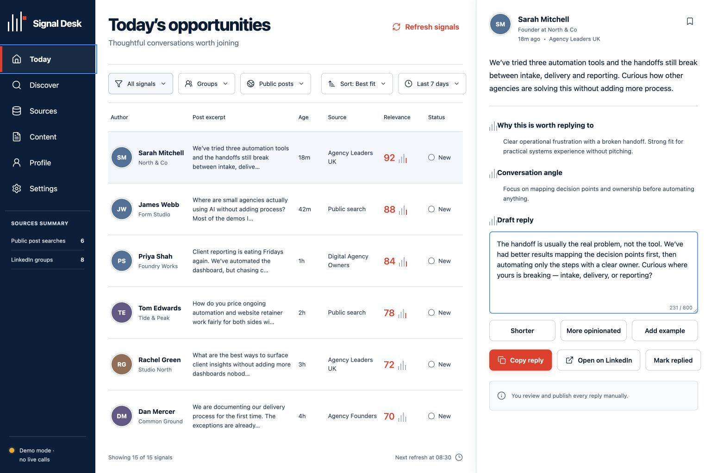

# Signal Desk

### Local LinkedIn Conversation Intelligence Workbench

Signal Desk is a local, single-user workspace for finding relevant LinkedIn conversations, evaluating their fit, and preparing thoughtful responses. It combines configurable post collection, company evidence, AI-assisted ranking, reply drafting, content research, and profile positioning in one review interface.

Signal Desk is deliberately human-in-the-loop. It does not publish posts, send messages, create connections, modify a LinkedIn profile, or comment on the user's behalf.



## Overview

The application turns a plain-English description of a target customer into an editable research and review workflow:

```text
Target customer brief
        |
        v
AI-assisted LinkedIn search planning
        |
        v
Approved Apify post collection
        |
        v
Normalization + seven-day freshness checks
        |
        v
Companies House evidence enrichment
        |
        v
AI ranking, analysis, and reply drafting
        |
        v
Manual review, editing, copying, and tracking
```

All application state is stored locally in SQLite, with optional readable JSON snapshots. External providers receive only the data needed for collection, enrichment, or analysis.

## Features

### Conversation Discovery

- Generates editable LinkedIn search suggestions from a target-customer brief.
- Collects approved public-post searches through Apify.
- Normalizes actor responses and excludes malformed or stale posts.
- Processes multiple sources and AI-analysis batches with bounded concurrency.
- Retains a decision ledger explaining which candidates reached the review queue.

### Evidence and Ranking

- Enriches inferred company names with Companies House search and officer data.
- Labels evidence as `verified`, `likely`, or `unknown` rather than presenting inference as fact.
- Scores posts against configurable ICP, offer, proof points, voice samples, and banned phrases.
- Produces fit reasons, conversation angles, risk flags, and draft replies.
- Falls back to transparent local freshness and conversation scoring if AI analysis fails.

### Review Workspace

- Presents the highest-ranked opportunities in a focused daily queue.
- Supports reply editing, copying, saving, and replied-state tracking.
- Links directly to the original LinkedIn post and author profile.
- Keeps publishing and final judgment with the user.

### Content and Profile Tools

- Extracts reusable content ideas from reviewed conversations.
- Provides a lightweight workspace for editing hooks and post drafts.
- Generates LinkedIn profile positioning from a business brief.
- Produces headline, About, Featured, Experience, contact-path, ICP, offer, and proof-point suggestions.
- Saves profile revisions locally for later iteration.

### Local Operations

- Stores structured data in SQLite using WAL mode.
- Can write human-readable JSON snapshots for inspection or backup.
- Runs manual collection or an in-process daily schedule.
- Recovers interrupted collection records when the backend restarts.
- Purges normalized posts and candidate-review records after 30 days.

## Technology

| Layer | Technology |
| --- | --- |
| Client | React 19, TypeScript, Vite, Lucide |
| Server | Node.js, Express 5, Zod |
| Storage | Node SQLite, local JSON snapshots |
| Collection | Apify LinkedIn post actors |
| Analysis | OpenRouter chat completions with structured output |
| Company evidence | Companies House API |
| Scheduling | node-cron |
| Testing | Vitest, Supertest |

## Architecture

```text
React client
    |
    | same-origin JSON API
    v
Express server
    |-- SQLite store + JSON snapshots
    |-- Apify collection adapters
    |-- Companies House evidence adapter
    |-- OpenRouter analysis and writing adapters
    `-- In-process collection scheduler
```

The server binds to `127.0.0.1` and serves the production client from `dist/client`. Collection runs asynchronously after the API accepts them, while the client polls for updated state.

## Getting Started

### Prerequisites

- Node.js 22.12 or newer
- npm
- API credentials for OpenRouter, Apify, and Companies House

### Installation

```bash
git clone git@github.com:nikhilp1234567/signal-desk.git
cd signal-desk
npm ci
cp .env.example .env
npm run dev
```

Open `http://127.0.0.1:5173`.

The `.env` file is optional if credentials will be entered through the first-run setup dialog. A clean installation contains no sample sources, opportunities, profile copy, or generated content.

### Production-Style Local Run

```bash
npm ci
npm run build
npm start
```

Open `http://127.0.0.1:8787`. The application is designed for a trusted local workstation; it is not configured as a public multi-user service.

## Configuration

| Variable | Required | Purpose |
| --- | --- | --- |
| `APIFY_API_TOKEN` | Yes | Authenticates Apify collection requests. |
| `OPENROUTER_API_KEY` | Yes | Enables search planning, ranking, drafting, and profile generation. |
| `COMPANIES_HOUSE_API_KEY` | Yes | Enables UK company and officer evidence lookups. |
| `OPENROUTER_MODEL` | No | Provides the server-level fallback OpenRouter model. |
| `SIGNAL_DESK_PORT` | No | Sets the Express port. Defaults to `8787`. |
| `SIGNAL_DESK_MAX_CHARGE_USD` | No | Sets the Apify charge limit for each actor invocation. Defaults to `2`. |

Credentials can also be entered under **Settings → Connections & storage**. UI-entered values are stored in `data/secrets.json`, take precedence over environment values, and are not returned to the browser after saving.

`SIGNAL_DESK_REFRESH_TIME` remains in `.env.example` for future configuration work but is not currently read by the server. Change the schedule in the application settings and restart the backend to apply it to the running scheduler.

## Application Workflow

1. Complete the local credential setup.
2. Describe the audience or buyer profile you want to find.
3. Generate search suggestions or add a public LinkedIn post search manually.
4. Review and approve the query before collection starts.
5. Run collection manually or leave the local backend open for scheduled collection.
6. Review ranked opportunities, evidence, fit reasons, and draft replies.
7. Edit and copy a reply, then engage manually on LinkedIn.
8. Save useful themes as content ideas or use the profile workspace to refine positioning.

## Data and Privacy

Signal Desk keeps persistence local, but processing is not fully offline:

- Apify receives approved search queries and collects LinkedIn post data.
- OpenRouter receives relevant post text, author context, targeting settings, voice guidance, and profile briefs for analysis or generation.
- Companies House receives inferred company-name searches.
- Local SQLite and JSON files may contain names, profile URLs, post content, draft replies, business positioning, and engagement history.

Local data is written under `data/`:

```text
data/
  signal-desk.sqlite
  signal-desk.sqlite-wal
  signal-desk.sqlite-shm
  signal-desk.json
  secrets.json
```

These files are excluded from Git. `secrets.json` and JSON snapshots are written with owner-only permissions. The SQLite file follows the host machine's default file permissions.

The 30-day retention process applies to normalized posts and candidate-review records, not every stored entity. Opportunities, content ideas, run history, profile versions, and related records remain until removed from local storage.

## Security Model

- The HTTP server listens on loopback only.
- API keys remain server-side and are never included in bootstrap responses or snapshots.
- API and generated structured data are validated with Zod.
- There are no LinkedIn publishing, messaging, connection, or profile-modification routes.
- The API has no authentication because it is intended for one user on a trusted local machine.

Do not expose the server directly to a network or public reverse proxy without adding authentication, authorization, CSRF/origin controls, TLS, and hardened secret storage.

Collection relies on third-party Apify actors rather than the official LinkedIn API. Review the actors' behavior, applicable privacy requirements, and LinkedIn's terms before using live data. Actor schemas and availability can change independently of this project.

## Scripts

| Command | Purpose |
| --- | --- |
| `npm run dev` | Runs the Express API and Vite development server together. |
| `npm run build` | Type-checks the project and builds the production client. |
| `npm start` | Starts the local server and serves an existing client build. |
| `npm test` | Runs the Vitest suite once. |
| `npm run test:watch` | Runs tests in watch mode. |
| `npm run typecheck` | Runs the TypeScript project build without Vite bundling. |

## Verification

```bash
npm run typecheck
npm test
npm run build
```

The test suite covers API behavior, provider response normalization, fallback ranking, credential handling, persistence snapshots, and bounded AI batching.

## Current Scope

Signal Desk is a functional local prototype, with several intentional boundaries:

- Public LinkedIn post searches are the supported source type in the current UI.
- The content workspace is an editor for saved ideas and drafts, not a complete AI publishing system.
- Collection jobs and scheduling run inside the server process rather than a durable job queue.
- Schedule changes require a backend restart.
- The Apify charge cap applies per source invocation, not across an entire collection run.
- There is no hosted deployment, user authentication, browser end-to-end suite, or LinkedIn publishing integration.

These constraints keep the application focused on research, drafting, and manual review rather than autonomous social engagement.
